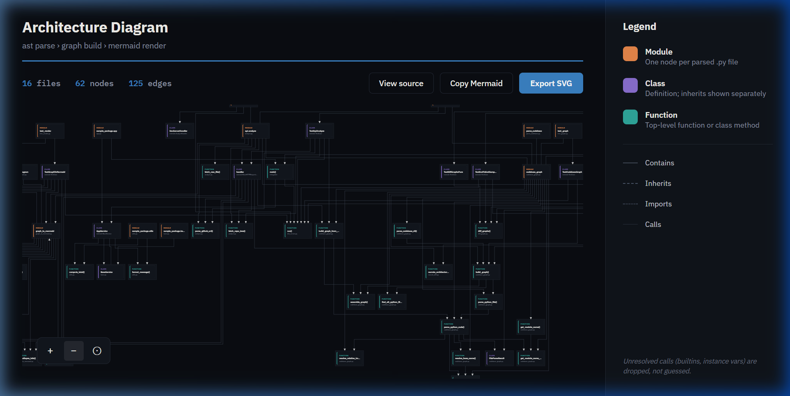

# Codebase Architecture Visualizer

> 🚀 **Try it live:** [https://archgraph.vercel.app](https://archgraph.vercel.app)

> Turn any Python codebase into an interactive, high-level architectural diagram with dependency mapping, git revision diffing, and AI-powered narration.

[](https://archgraph.vercel.app)
[](https://www.python.org/)
[](LICENSE)
[](#tech-stack)

---

## Live Demo

Explore public GitHub repositories directly in the browser:  
🔗 **[https://archgraph.vercel.app](https://archgraph.vercel.app)**

---

## Architectural Diagram

Here is the Codebase Architecture Visualizer analyzing its own core architecture (16 files, 62 nodes, 125 dependency edges):



---

## How It Works (End-to-End)

```
GitHub / Local Repo ──> AST Parser ──> Structural Graph ──> LoD Filter ──> Interactive Studio Canvas
                             │                                    │
                             ├──> Git Revision Differ             └──> Groq AI Narration (openai/gpt-oss-120b)
```

1. **AST Analysis (`codebase_graph.py`)**: Traverses source files using Python's native `ast` module to extract modules, classes, inheritance hierarchies, import graphs, and call targets without executing user code.
2. **Level-of-Detail (LoD) Collapsing (`graph_to_mermaid.py`)**: Automatically prevents visual bloat on large codebases (>150 nodes) with intelligent two-tier collapsing:
   - *Tier 1*: Omits function nodes, badge-attributing counts to parent classes/modules.
   - *Tier 2*: Escalates to module-level view with combined class and function badges for very dense repositories (e.g. Pygments).
3. **Architecture Studio (`index.html`)**: Renders diagrams via Mermaid.js and ELK with pan/zoom canvas controls, fullscreen toggle, SVG export, and an overhead collapse indicator.
4. **Structural Git Differ (`diff_graph.py`)**: Computes semantic additions, removals, and modifications between git revisions (branches or commits).
5. **Architectural Narration (`narrate_diff.py`)**: Generates executive summaries of codebase structure and pull-request impact via Groq API (default model: `openai/gpt-oss-120b`).

---

## Tech Stack

- **Core Analysis**: Python (`ast`, `pathlib`, `collections`) — zero heavyweight parser dependencies
- **Visualization**: [Mermaid.js](https://mermaid.js.org/) with [ELK layout engine](https://www.eclipse.org/elk/) for clean orthogonal geometry
- **AI Engine**: [Groq API](https://groq.com/) running `openai/gpt-oss-120b`
- **Frontend**: Vanilla HTML5, CSS3 studio layout, SVG pan/zoom transform matrix
- **Cloud Runtime**: Vercel Serverless Python Function (`api/analyze.py`)
- **Cost**: 100% Free-Tier compatible (runs on free serverless and free Groq credits with zero database requirements).

---

## Quickstart & Local Setup

### 1. Clone & Install
```bash
git clone https://github.com/AaruneshAP/archgraph.git
cd archgraph
pip install -r requirements.txt
```

### 2. Environment Setup (Optional for AI Narration)
Create a `.env` file in the root directory:
```bash
GROQ_API_KEY="gsk_your_groq_api_key_here"
```

### 3. Run Locally

**Start the interactive web visualizer:**
```bash
python dev_server.py 3000
# Open http://localhost:3000 in your browser
```

**Or run the CLI to visualize any local directory:**
```bash
# Analyze this repo or any local project:
python codebase_graph.py . -o graph.json
python render_diagram.py graph.json

# Open the generated standalone viewer:
# Windows:
start graph.html
# macOS/Linux:
open graph.html
```

**Run Automated Tests:**
```bash
python -m unittest discover -p "test_*.py"
```

---

## License

MIT License. Free for open-source exploration and educational use.
